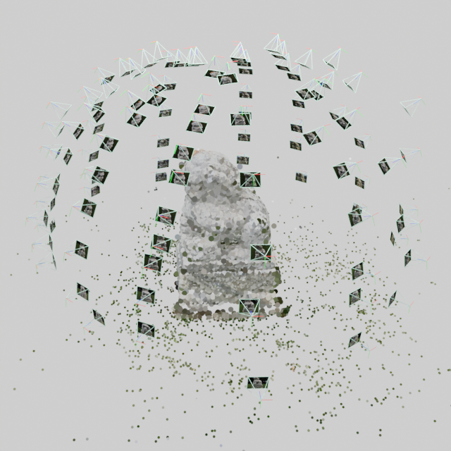

Some tools for visualizing COLMAP data in Blender, with results shown in the figure

## ToDos
🔥 Feel free to raise any requests~
- [ ] An interactive plugin for adjusting parameters.
- [ ] The cameras can actively switch viewpoints instead of being merely for visualization.